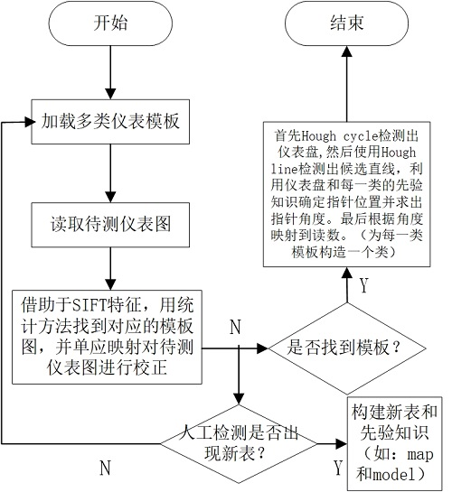
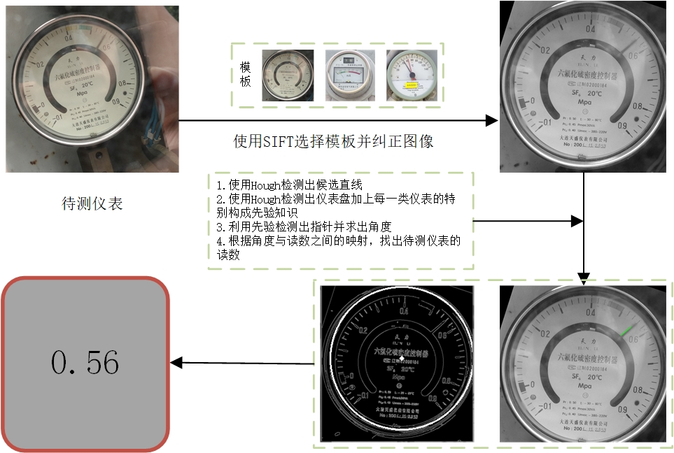

# SIFT-Hough-for-multi-type-pointer-meter-reading

We refer to the following paper and modify it according to the characteristics of our task.
```

[1]张雪飞,黄山.多类指针式仪表识别读数算法研究[J/OL].电测与仪表:1-7[2020-06-11].
http://kns.cnki.net/kcms/detail/23.1202.TH.20200601.1022.006.html.
```
## Flow-chart


## Preparation

### Pre-requisites
* Python 3.6
* opencv-python = 3.4.2
* numpy = 1.18.5

### Installation

* git clone code

```bash
$ git clone https://github.com/tangzhenjie/SIFT-and-Hough-for-multi-type-pointer-meter-reading.git
```

* the directories structure

```
  Framework                           
  ├── DegreeToNum        % the dir storing the model for each template
  ├── img_test           % the dir storing the test image (suggested)
  ├── img_test_corrected % the dir storing the corrected images (suggested)
  ├── template           % the dir storing the template images
  ├── img_match.py       % the sift matching code
  └── read_num.py        % the main code
```

### Run

```buildoutcfg
python read_num.py $your_test_img_path
```

## Result



